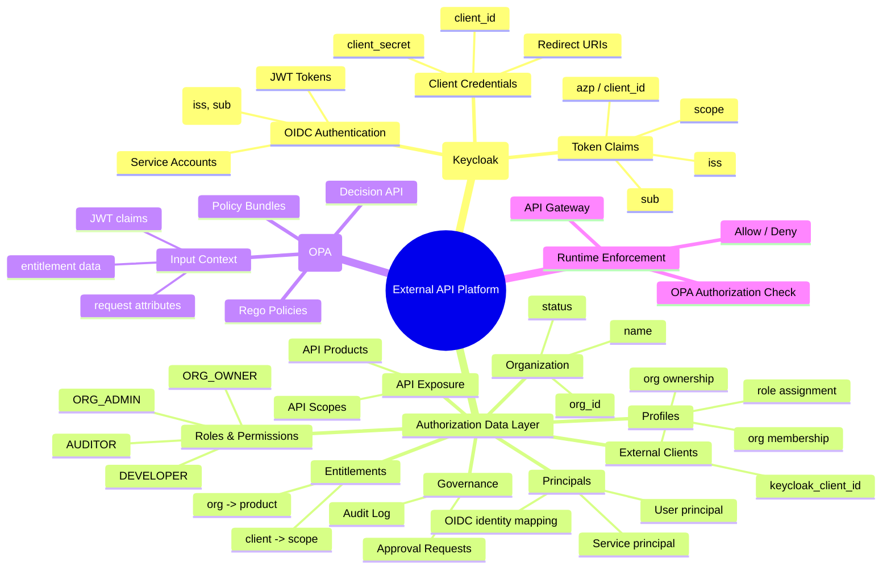

# External OpenAPI Client Registration — Mermaid Architecture (Keycloak + OPA)

## Overview

Architecture assumptions:

- OIDC authentication and client credentials are managed by Keycloak.
- Authorization enforcement is performed by an OPA server.
- Internal database stores:
  - organizations
  - principals
  - roles and profiles
  - client ownership
  - API entitlements
- API Gateway delegates authorization decisions to OPA.

---

## 1) Platform Mind Map (Mermaid)

